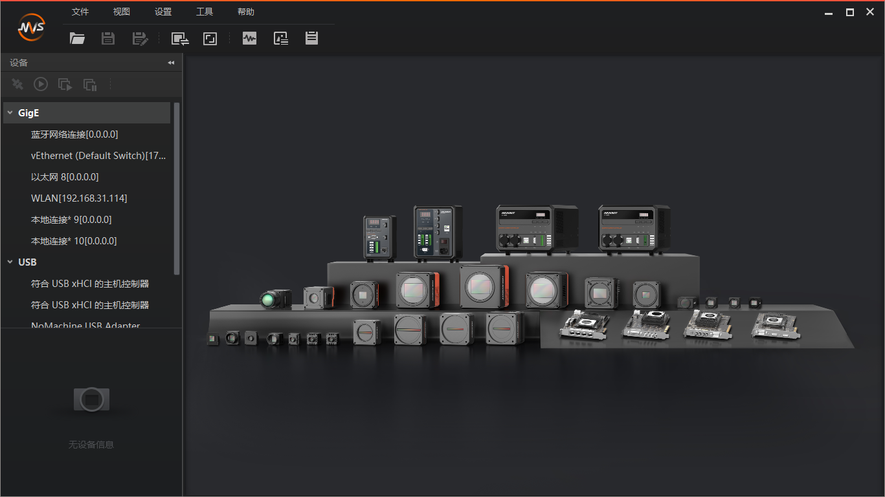
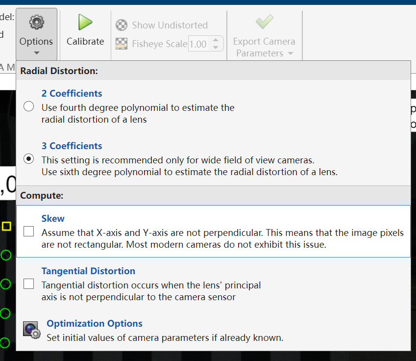

# 认识海康工业相机

海康工业相机是视觉组使用的主要拍摄硬件。本文档旨在把一些之前口口相传的经验记录下来，减少错误和时间的浪费。

## 使用MVS进行拍摄

下载并运行海康MVS客户端。如果是装在车上的工控机，可以直接:

```bash
bash /opt/MVS/bin/MVS.sh
```

会出现海康的带GUI的客户端



在USB选择合适的相机进行拍摄

<!-- TODO：手头没相机，没写完 -->

## MVS相机的参数

作为花了上千块钱买的工业相机，MVS相机支持丰富的参数调整。但是我们平常可能会需要调整的参数其实就以下几种。此处可以配合[XJTU-RMV/DX_aimbot: An auto aim program.](https://github.com/XJTU-RMV/DX_aimbot)中的一些config食用。

### 曝光类

分为曝光时间，曝光补偿和相机伽马。

**曝光时间：** 在config文件中的描述形式如下，单位为us，一般不超过5000(超过5000之后相机取流速度会受到影响)

```yaml
#===曝光时间===#
enable_auto_exp: 0 # OFF
energy_exp_time: 2000
armor_exp_time: 1600
```

**曝光增益：** 在config文件中的描述形式如下，调节`gain`可以让曝光提高而曝光时间不改变。最高为16.9或17.0，继续调高没有作用。

```yaml
#自动相机增益使能，0为OFF
enable_auto_gain: 0
#相机增益值
gain: 17.0
```

**伽马：** 在config文件中的描述形式如下，调节`gamma_value`可以让画面亮度发生变化。相机中的Gamma是对图像进行非线性亮度变换的过程，目的是为了更好地匹配人眼对光线强度的非线性响应特性。不是所有的相机都支持该选项，也不建议对该选项进行调节。如必须调节请保证多次测试调节后的效果，若没有发生效果请调节回原值。

```yaml
#相机伽马值，只有在伽马修正开启后有效
gamma_value: 0.7
```

## MVS报错和状态灯

错误代码：[海康 SDK 错误代码返回代码状态码大全 - 简书](https://www.jianshu.com/p/ac4c5466ca5b)

<!-- TODO:状态指示灯 -->

## 相机标定

相机标定需要使用待标定的相机拍摄标定板（棋盘格），拍摄多张图片，使用MATLAB或Python进行标定。

相机标定是视觉组梯队队员或正式队员极有可能会被分配到的一项任务，下面直截了当的给出相机标定的一个比较标准的流程，避免重复劳动。

同时，相机标定也有可能是某些同学大三计算机视觉课程实验的一部分，或许你可以拿这些图片去应付实验。

### 使用MATLAB进行标定

参考[【Matlab】相机标定（计算机视觉工具箱）_matlab相机标定-CSDN博客](https://blog.csdn.net/qq_40344790/article/details/127241652)

注意Option需要选择3 Coefficients，表示计算3个畸变参数：k1, k2, k3



### 使用Python进行标定

你都用python了，那就python自强吧。
